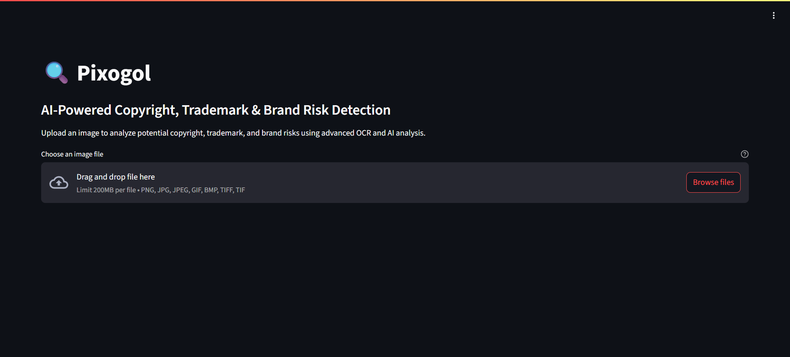
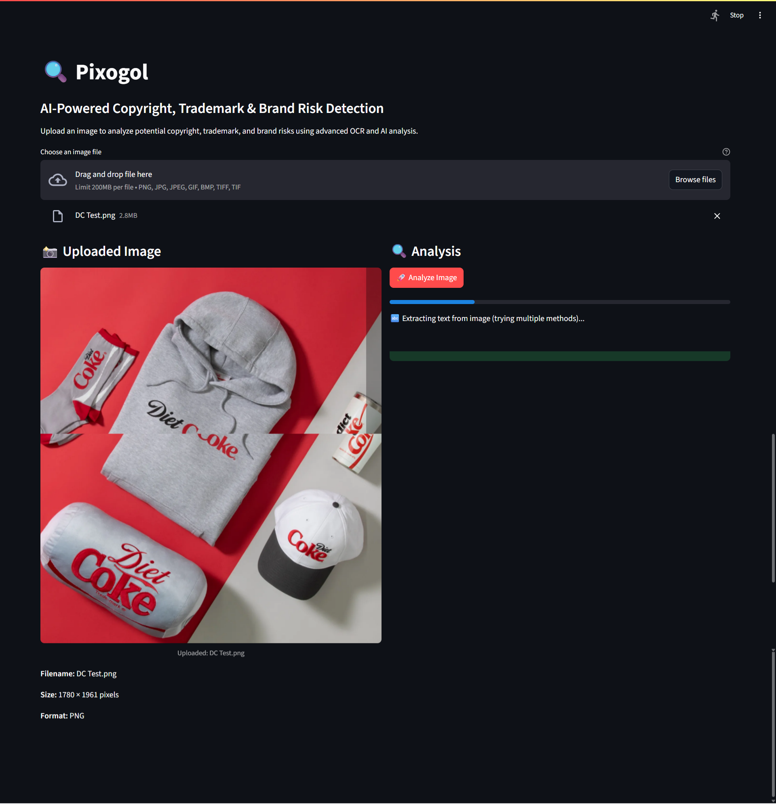
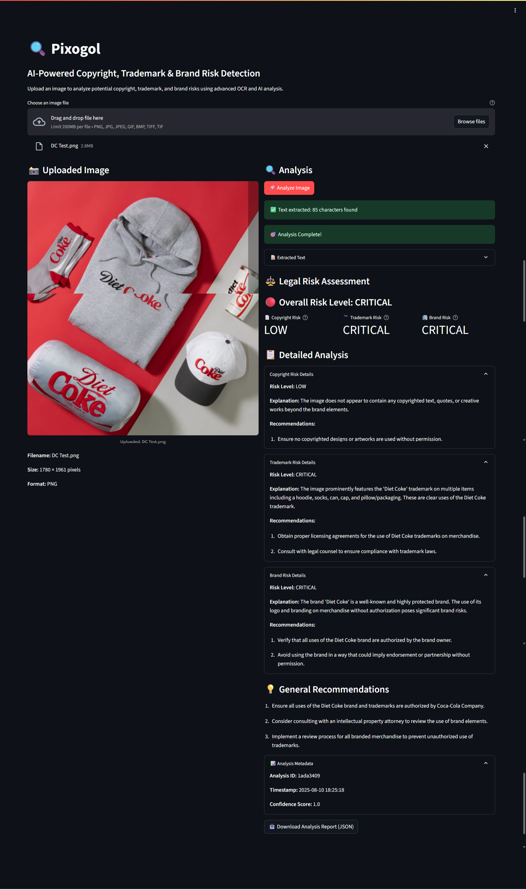

# Pixogol 🖼️  
AI-Powered Copyright, Trademark & Brand Risk Detection for Images

Pixogol is an AI-powered compliance tool that scans images for potential brand, copyright, and trademark risks before publishing. It detects logos, branded elements, and protected visual content, helping creators, marketers, and agencies avoid legal issues. Designed for photographers, designers, and content creators, Pixogol provides actionable insights so you can make informed decisions before sharing your work.

## 🔧 Features
- AI-driven image scanning for brand logos and copyrighted material
- Risk classification for potential trademark or copyright issues
- Detailed detection results with confidence scores
- Ability to review individual flagged elements
- Exportable risk reports (CSV or JSON)
- Error handling for unsupported formats
- Simple drag-and-drop or file select upload interface

## 🖼️ Screenshots
| Dashboard View | Analysis In Progress | Risk Analysis Results |
|----------------|----------------------|-----------------------|
|  |  |  |

## 🖥️ Tech Stack
- **Frontend:** React (TypeScript), Vite, Tailwind CSS, shadcn/ui with Radix UI
- **Backend:** Express.js (TypeScript), Node.js
- **AI/ML Services:** Brand/logo detection model (custom or third-party API)
- **Storage:** Local file handling or cloud storage (e.g., AWS S3, Google Cloud Storage)
- **Validation:** File type and size checks with server-side safeguards

## 🚀 How It Works
1. Open Pixogol in your browser
2. Upload an image via drag-and-drop or file selection
3. Pixogol scans the image for potential brand and copyright risks
4. View results with flagged areas, confidence scores, and descriptions
5. Export a risk report for your records or client review

## 🛡️ Security & Privacy
- Images are processed securely and never shared with third parties
- Temporary storage with automatic cleanup after processing
- HTTPS enforced for all API communications

## 📦 Setup Instructions
**Prerequisites**
- Node.js 18+
- API key for brand/logo detection service (if applicable)
- Cloud storage credentials (optional)

**Environment Variables**
DETECTION_API_KEY=your_detection_api_key  
STORAGE_BUCKET_NAME=your_bucket_name  

**Installation**
1. Clone the repository:  
   git clone https://github.com/your-username/pixogol.git  
   cd pixogol
2. Install dependencies:  
   npm install
3. Set up your `.env` file with required keys
4. Start the development server:  
   npm run dev
5. Access Pixogol at:  
   http://localhost:5000

## 🧩 Future Enhancements
- Video content scanning
- Batch upload and multi-image analysis
- Integration with DAM (Digital Asset Management) tools
- More granular legal risk scoring

## 📄 License
MIT License – See LICENSE file for details

## 📞 Support
For issues or feature requests, please open an issue on the GitHub repository.
